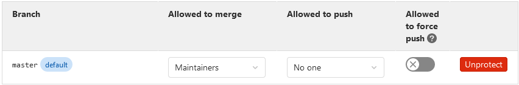

# Introduction

## Scope

This course is made for you. It is part of d-fine's introductory curriculum for
new hires. Its aim is to **impart basic IT knowledge**, so that you can hit the
road running when staffed on your first d-fine project.

The course covers several inter-dependent topics, viz.

- Version Control with `git`;
- Programming & Testing; and,
- Continuous Integration (CI) With GitLab.

## Intent

As prerequisites differ, the training is offered in the form of _supported
self-study_. This means that instead of following a presentation of a week's
worth of topics, you can follow the plan of the course _at your own pace_.
As everyone brings different prerequisites, the course is designed in such
a way that even participants with previous knowledge will be busy for a few
days. This means that we **do not expect participants with little or no
previous technical knowledge to be able to work through the course
completely** in the allotted time.
During the course, an instructor will always be available to _help you_ with
any questions that you cannot figure out for yourself (see also
[Where to get help](#where-to-get-help)).

Almost every chapter consists of both a theoretical and a practical part. You
are encouraged to follow the practical exercises and hand them in once you are
done. Your instructor will review your submissions and give you timely feedback.

_The aim of this exercise is not to assess you, but to enable you to deliver
value in your future work._ Functional IT knowledge is at the core of our work
on many projects. Therefore, although we are well aware that one could easily
create and distribute solutions for the practical exercises, we would like to
appeal to your common sense in discouraging you from engaging in such a
practice: In most cases, reading someone's solution to a problem without having
yourself attempted to solve it does _not_ have the effect of conveying the
desired proficiency. **We ask you to refrain from copying solutions, for your
own good, and for the good of others.**

Of course, you can support each other and ask questions in the course channel
to clarify ambiguities and answer your questions.
However, as a rule of thumb, whenever you encounter a problem,
don't immediately turn to someone else, you
should spend up to 10-15 minutes trying to figure it out yourself
by studying the training material and researching online. Only when this does
not resolve your issue should you consult someone for help
(see [Where to get help](#where-to-get-help)). This serves two
purposes: First, you will learn more, and secondly, it prevents overwhelming
the trainers with questions you could potentially quickly answer yourself.

Note also that this course is not intended to make you an expert programmer.
Its aim is to hand you a toolbox with just enough inside to get you started.
Feel free to deepen your knowledge in any of the individual areas, and to
broaden it to any of the many others that are out there.

_We hope you will enjoy this training course. We are dedicated to the continual
improvement of our course materials. Therefore, if you have **questions,
comments, or any other feedback, please feel free to reach out to your course
instructors**._ Even better, fork the `basis-it-training` repository, make a
merge request against the master branch with your improvements, and assign it to
your instructor. (You are going to learn how to do this during the training.)

## Schedule

The general idea of the course is that you should follow it at your own pace.
However, we have an idea of what we would like you to learn and
make the following recommendation:

| Course section | When to complete | Countermeasures if you are out of time |
| --- | --- | --- |
| Version control with `git` | Complete the `advanced` section by end of the first day | Get help, try to complete it by noon of the second day, o/w abort and continue |
| Programming & Testing with Java | At least have some running unit tests by the end of the third day | Get help, try to complete unit tests by noon of the fourth day, then abort and continue |
| Continuous Integration (CI) with GitLab | At least have a basic pipeline running by the end of the course | If you haven't started working on a basic pipeline by noon on the fourth day, get help |

To guide you through the course, we have marked the sections of the course as
core and/or elective. In addition, every section contains some guidance
on until when you should complete it to stay on track.

## Where to get help

As noted above, an engagement with the course materials and a brief
online research is part of the expected scope of the course.
If you need help or have questions, follow the steps below:

- Look closely at the course material (~5 min).
- Try to answer your question via online search (~5 min).
- Pose your question to another course participant or in the common MS Teams
course chat.
- If your question is not answered in the common MS Teams course chat after
another 5 minutes, call one of the instructors.

## Submitting solutions to exercises

In the course of this training, we will ask you to submit the solutions to every
exercise at the end of each chapter. Please submit the solution to every
exercise as soon as you are done with it to receive prompt feedback.

### Review process for the first chapters on git

For the git chapters in the first part of the training you will need to write
bash scripts and send those to the supervisors of this training using _Microsoft
Teams_.\
In order to do so:

- Create a new MS Teams Group Chat (_not_ a new Team) named `<your last name>_Basic_IT_Training` to
  which you should add your trainers, together with yourself.
- Upload your bash scripts which executes all commands necessary to complete the
  exercise.\
  _Hint:_ Your bash saves the last 500 commands you executed in a hidden file
  called `.bash_history` which you can find in your home directory. You can use
  this history file to collect the commands you would like to add to your bash
  script in case you forgot to write them down right away. Just navigate to your
  home directory and display the file:

  ```lang-bash
  cd ~
  less .bash_history
  ```

  Copy only the necessary commands and paste them to a text file. (NB: As per
  convention, shell scripts are saved with the file extension `.sh`.) Remove
  errors or repetitions and send the saved file to your trainers.

  Be aware that the content of the `.bash_history` file is not being updated
  dynamically but only after the respective session of your bash has been closed.
- One of the reviewers will get in touch with you, and either send you their
  review in text form or schedule a call to discuss your solution. Feel free to
  reach out in the case of any further questions.
- Please use the above mentioned MS Teams Group Chat for submitting and
  discussing your solutions only. All other questions and discussion should be
  performed in the overarching MS Teams Group Chat in order to allow other
  participants to benefit from the answers as well.

### Review process for programming as well as GitLab exercises

In the last git chapter however, you will learn the [Basics of
GitLab](gitlab/GitLabBasics). Therefore, from then on until the end of this
training we will ask you to hand in your solutions directly via GitLab merge
requests. Hence bash scripts are not required anymore from there on out.

_General setting for your project:_

In case you have created your project as private, invite your trainer by
clicking on "Members" on the left side of you project page, add the e-mail
address of your trainer, choose "Developer" as permission role and click on
  "Invite".

In order to ensure that we stick to merge requests of feature branches into
main, we would like to prevent pushing into main by adjusting the GitLab
settings. This setting is also very useful in project life.

Please open your repository in GitLab and navigate to Settings -> Repository ->
Protected Branches. Change the setting "Allowed to push" to "No one" for the
main branch.



_Handing in solutions via GitLab:_

- You need to **create a new branch** (e.g. named development) from your master
  branch, commit your solution into this development branch and not into the
  master branch and then create a
  merge request from your development branch into your master branch.
- Afterwards, enter the merge request you just created, navigate to the
  _Overview_ tab and open the first thread by writing a comment
  in which you ask for a review mentioning all your trainers.

  _Note:_ You can mention other members in GitLab using the @ symbol
  followed by the member's username, i.e. `@GitLabUsername`.

  **Attention**: Make sure to address your trainers at the start of a line.
  Doing so, you will automatically create a To-Do on your trainers' GitLab's
  To-Do List as described
  [in the GitLab documentation](https://docs.gitlab.com/ee/user/todos.html#create-a-to-do-item-by-directly-addressing-someone).
- One of your trainers will assign themselves to the merge request,
  review your solution and if necessary add comments to
  your merge request. Comments in merge requests can be viewed in the "Overview"
  tab.
- Afterwards your trainer will assign the merge request back to you, either
  "Approved" or with comments. If your merge request has been approved you can
  merge your merge request into your master branch.
- Otherwise, rework your solution based on your trainers comments, commit and
  push the new version into your development branch and assign the merge request
  back to your reviewing trainer. If your updates satisfy your trainer's comment,
  your trainer will "Resolve" the respective open threads.
  **Note**: Once you push, your existing merge request is updated automatically.
  Thus, you should continue to use the existing merge request until it is
  approved and merged.
- Repeat this process until your trainer approves your merge request.

### Use dedicated branches for every exercise

Every solution should be handed in using a dedicated branch.
In particular, an ongoing review of a given branch
should not be disturbed by further commits related to another exercise.

We would like to describe the according process a little more in detail. The
initial situation is:

- We have a branch (B1) which is currently in a review process, and which should
  be merged into main.
- We now want to develop a new feature in a branch B2, which is dependent on the
  feature in B1.
  
#### Procedure

- Assuming that the new feature depends on the feature in B1, we create a new
  branch B2 from the branch B1.
  This also is possible from main and is probably especially useful if B1 and B2
  have nothing to do with each other, which might be the standard case at
  project work.
- We check out branch B2. We can now develop our feature within B2. Just continue working on B2 and push
  your commits normally.
- Whenever rework is needed for the merge request of B1, check out the branch
  B1, perform the changes, commit and push, and then go back to B2 in order to
  continue with the new stuff. Ensure that you do not have uncommitted changes
  when switching the branches.
- After the merge request was accepted and B1 was successfully merged into main,
  we now want to merge main into B2. This should not be postponed in
  order to detect merge conflicts at an early stage.
  We first need to fetch the new commits in order to have them available
  locally, and then we can merge the remote main branch into our working branch
  B2. We might need to resolve merge conflicts, commit the according changes
  and push them to the remote B2 branch.
- To keep the local repository clean, we delete the merged local B1 branch. The
  remote B1 branch should have been deleted automatically by accepting the
  merge request inside GitLab if the corresponding checkbox has been marked,
  otherwise the remote B1 branch could be deleted manually as well.
- Now we can continue working and developing the feature inside the branch B2.

Start now with [Git / Bash Installation](git/GitBashInstallation).

## Navigation

- [Continue with "Git / Bash Installation"](git/GitBashInstallation)
- [Return to top level](home)
