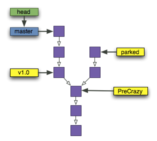
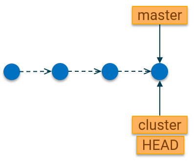
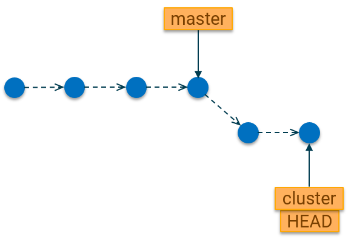
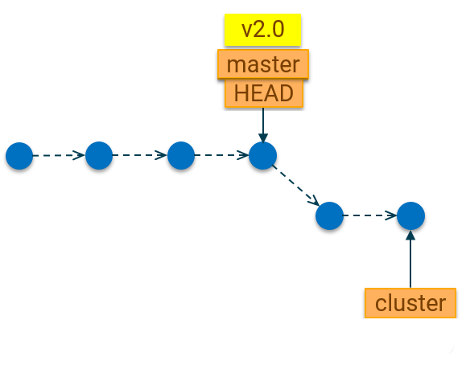

# Branches

\[\[_TOC_\]\]

| Is this section core or elective? | Expected time to completion |
| --- | ---- |
| core | by mid-afternoon on the first day |

## Learning goals

In the previous section, you learned the basics of Git as a distributed version
control system, which helps us to keep track of changes in code (and other
documents). You also learned some basic git terminology like a repository, a
commit etc.

In this section, you will learn about the Git concept of branches, which are
used to keep track of different sets of changes. We will learn how to create
them and how to merge them back together.

## Terminology

Before we go deep into branches, let us define some terminology, which will be
used throughout this section.

### What is a branch?

As you learned previously, a commit is a snapshot of current changes on files in
the repository. When working on some code or document, it is common to make
several commits, which capture a snapshot of the change at each point. This
builds a commit history.

A branch is a pointer to the last commit in a series of commits. A branch has a
name, which is easy to remember and points to a specific commit in your git
database. In the diagram below, the branch is marked in blue. Git repositories
typically have a master branch, which is the main branch.

### What is a Tag?

A tag is a pointer to any commit in the git history (marked in yellow in the
diagram below). Tags allow you to create a pointer to any commit in your
repository and easily get back to it, as tag names are easier to remember than a
commit hash.

`parked`, `v1.0` and `PreCrazy` are all tags which point to different commits in
the repository.

Tags are created using the following command: `git tag <tagname>`. For example:
`git tag v1.0`

`HEAD` is a special marker in Git, which always points to the commit which is
currently checked out. In most cases, this will be the same commit to
which your branch points to, but not always. It is possible to check out any git
reference (branch, tag, commit etc), and in that case HEAD will point to the
reference.

### Checkout

In Git, 'checkout' means to replace the contents of the repository with a
particular version. The version can be any git reference e.g. a branch, a tag or
a commit identifier (hash). When we say "checkout a branch" or that a branch is
"checked out", it means that the branch (or git reference) is currently active.
The repository contents have been switched to reflect the state at the commit to
which the git reference points.

## Why branches?

Branches allow you to manage multiple sets of changes in parallel. For example,
if you would like to try out a new idea but do not want to interfere with the
teams ongoing development efforts, you can easily create a new branch and test
it out.

Branches are lightweight - this means that a new branch is not a new copy of the
files in your repository. It is only a tracker to the changes. This means it is
easy and fast to switch between branches, making them an ideal tool for
prototyping of ideas.

## Creating branches

A branch is created in git using the command:

`git branch <new-branch-name>`

For example, let's assume you are on the master branch and would like to create
the branch named "cluster". You would need to execute the command:

`git branch cluster`

This creates the branch named cluster in your repository. However, the
repository is still on the master branch. In order to switch to the new
`cluster` branch, you would need to execute:

`git checkout cluster`

This moves the HEAD pointer to point to your cluster branch. You are now working
on the new `cluster` branch.

Both commands (branch and checkout) can be combined into a single command as
follows:

`git checkout -b cluster`

This creates a new `cluster` branch based on the current branch and switches to
it immediately.

After creating the new branch, you branch history might now look like this:

As you can see, both `master` and the new branch `cluster` are now pointing to
the same commit in the git history. `HEAD` is, as usual, pointing to the commit
which is currently checked out. This happens to be the same commit for both the
`master` and `cluster` branches.

If you add some new commits on your `cluster` branch, then your git commit
history would look like this:

We notice the following:

- The `master` branch remains pointing to the commit from which the branch was
  created. This means it is always possible to revert the content of the
  repository to that state by checking out the master branch.
- The `HEAD` pointer moves with the `cluster` branch as that is the currently
  active branch.

## Switching branches

After creating the new branch and making some commits on it, you might want to
go back to the master branch and continue your work on it. Switching back to the
master branch can be achieved with the command

`git checkout master`

Note that this does not delete the changes you made on the `cluster` branch. Git
remembers all those changes and they exist in parallel to your work on the
`master` branch. You can also add new commits on the master branch and continue
working in parallel.

## Creating tags

Before we add new commits, let us create a tag in order to always remember the
current state of the repository on the master branch. We can do so with the
following command:

`git tag v2.0`

After doing this, the repository will look like this:

Now suppose you add a new commit to the master branch. The git history would
look like this:

We notice the following:

- Again, note that the `HEAD` stays on the currently active (checked-out)
  branch.
- The git tag stays fixed to the commit it was created on. Unlike branches, tags
  do not move to point to the most recent commit on the branch line. This means
  a tag serves as a fixed reference point in the repository history which you
  can always go back to if needed.

If you would like to get the files in your repository back to the state at which
the tag was created, you can use the `git checkout <tagname>` command. For
example:

`git checkout v2.0`

As you have noticed, the `checkout` command also works with tag names. In fact,
it works with any git reference. Reference include branch names, tag names or
commit hashes.

## Deleting branches

Assuming that our experiment on the cluster branch did not work and we decide to
get rid of those changes. We can do so by deleting the branch.

`git branch --delete --force cluster`

This would remove the cluster branch and all its commits. Those changes in the
commits on that branch are now gone.

Tip: Technically, the changes are not gone and still exists in the git
database. But for simplicity, let's assume they are gone.

There are a few things to note about deleting branches.

1. You cannot delete a branch, which is currently checked out. That means if you
   are on the `cluster` branch, git will refuse to delete it. That would be like
   taking out the engine of the car while driving. I'm sure you'll see that that
   is a bad idea.
1. You might be wondering why we have a `--force` option in the above command.
   If we try to delete the cluster branch without having merged the changes from
   cluster into the master branch, git will refuse to delete. This is a safety
   feature to prevent you from accidentally deleting things that have not yet
   been integrated into the main line. If we are sure we want to delete, then we
   can use the `--force` option to tell git to delete anyway.

But what if our cluster experiment was successful and we want to merge the
commits from cluster into our main line (`master`) branch. Well, git also has
you covered there. Moreover, merging will be the focus of the
[next section](./Merging).

## Further reading

Here are some resources you can look up if you would like to learn more about
branches:

- [Basic Git Branching and Merging](https://git-scm.com/book/en/v2/Git-Branching-Basic-Branching-and-Merging)
- [Git Branches in a Nutshell](https://git-scm.com/book/en/v2/Git-Branching-Branches-in-a-Nutshell)
- [Git Branch command reference](https://git-scm.com/docs/git-branch)
- [Atlassian Git Branch Guide (includes video)](https://www.atlassian.com/git/tutorials/using-branches)
