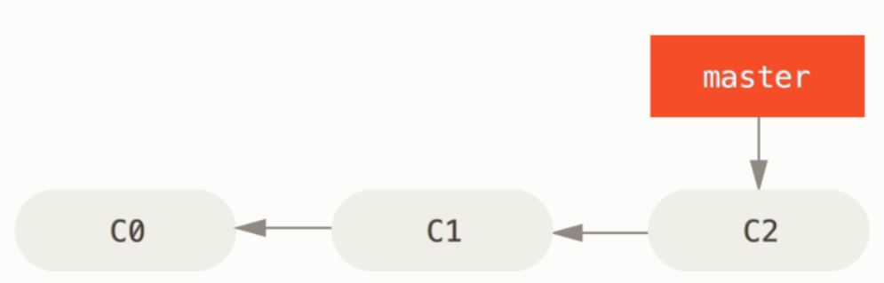
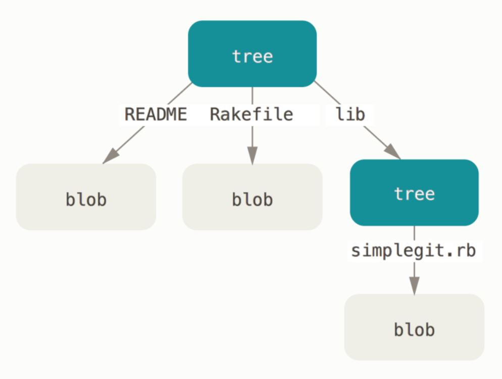
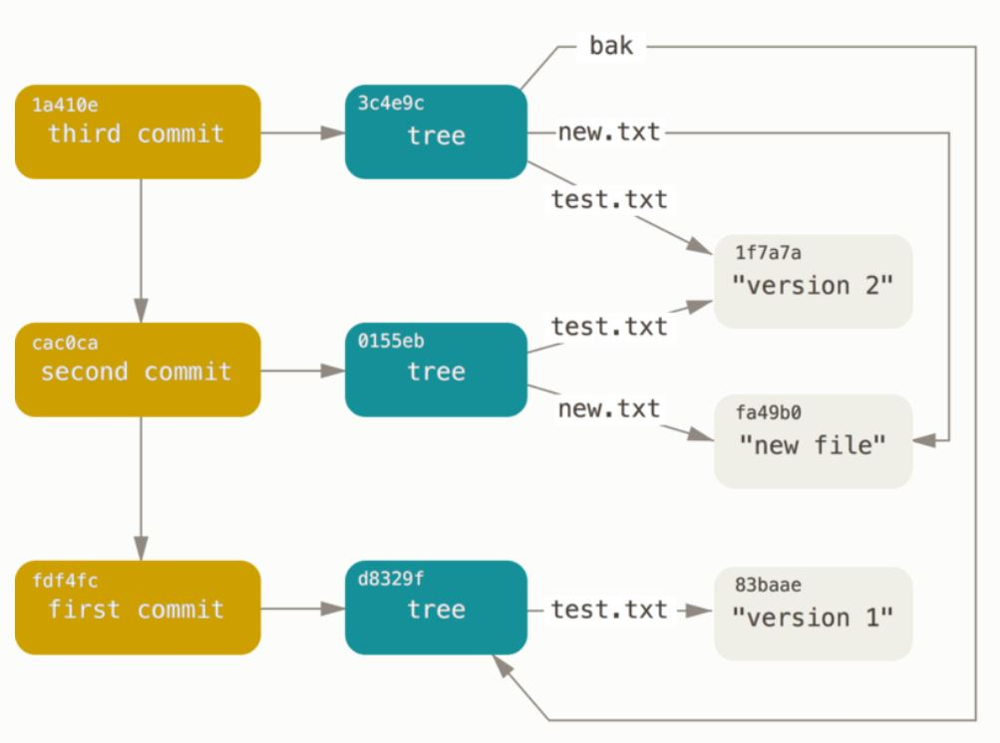
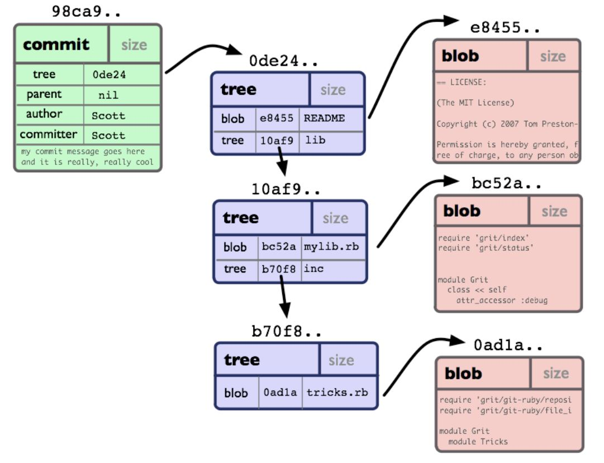

# Git basics

[[_TOC_]]

| Is this section core or elective? | Expected time to completion |
| --- | --- |
| core | before third meeting |

## Introduction

Git is a free, open source, distributed version control system for files. Git
can track, store and merge changes on files. Thereby Git allows to recover older
versions of the files tracked. Moreover, multiple developers can work on
different versions (branches) of the files, share their work among each other,
and merge their changes into a joint version. All these functionalities make Git
a strong tool for software development in teams.

For further reading on why to use Git, consult [Atlassian's "Why
Git"](https://www.atlassian.com/git/tutorials/why-git) or [GitLab's
version-control](https://about.gitlab.com/topics/version-control/) pages.

## Objective

This chapter introduces the basics of Git. To do that, the two objects
_repository_ and _commit_ are explained. Moreover, the basic Git commands are
introduced, allowing you to initialize a new Git repository, add and commit
files and changes, as well as retrieve older versions of files. Within the scope
of the Git basics training, we focus on operations performed locally on your
machine. However, a local Git repository can also be connected to a remote
repository, which is hosted in the internet or on a server in your network. The
concept of a _remote repository_ will be explained in the [Git
advanced](./git_advanced/GitAdvanced) and the [Git expert](./GitExpert) sections.

## Repository

For each folder under git control, the repository can be found in a hidden
directory `.git` which is created automatically when initializing a new Git
repository. It contains configuration files, information about the tracked
files, your commit history, and more.

The files next to the `.git` folder are the files under version control, also
called _checkout_ or _working directory_. When using `git`, users usually do not
need to access this folder directly; rather, they interact with it through the
`git` application.

Each Git repository has a so-called _index_, which is a staging area where
changes are collected before they are committed. The index of a Git repository
can also be found in `.git`.

Optionally, `git` can be told to ignore certain files and folders, or all
files/folders with a specific name pattern, in the repository's directory.
In order to do so, a text file called `.gitignore` containing a list of the
files/folders to ignore has to be stored in the repository's root directory.
Ending the name with a backslash identifies the object to be ignored as a
directory instead of a file.

Example for a `.gitignore` file:

```bash
# ignore a file which is called "file_to_be_ignored.txt"
file_to_be_ignored.txt
# ignore all zip files as well
*.zip
# ignore a directory (and all its content)
directory_to_be_ignored/
```

For more details on `.gitignore` see the
[respective section on the official Git homepage][git-ignore].

## Commit

A _commit_ is a snapshot of the current changes to the files in your repository.
Each commit has a unique _commit id_ (a.k.a. _commit hash_), as well as a
reference to its parent commit. The collection of all commits represents the
history of all the changes to a repository. They tell you how your repository
came to be the way it currently is. Therefore, the commit is the fundamental
object of a version control system.

## Staging and creating a commit

While you are working on the files in your working directory, you can _stage_
changes, which means that you add the changes to the index of your repository.
Note that only the changes in files you specify are staged. This process of
staging changes on files prepares your next commit.

When all changes intended to go into the next commit have been staged, you can
create the next commit. By doing this, a new commit object is created in your
repository containing all staged changes. Notice how the index thus enables you
to commit only a part of the changes you made should you wish to do so.
Moreover, the current commit is set as parent of the new commit and the new
commit is set as the current commit.


source:
https://book.git-scm.com/book/en/v2/Git-Branching-Basic-Branching-and-Merging

Simple commit history with commits _C0_, _C1_ and _C2_

## How Git stores your files

At lowest levels, Git keeps track of your data using four fundamental objects:
_commits_, _trees_, _blobs_ and _annotated tags_ which in the following will be explained
in more detail.

The contents of the files in your repository are stored as _blob_ objects in
`.git/objects` where each file can be identified by its own
[SHA-1](https://en.wikipedia.org/wiki/SHA-1) hash.

When creating a _commit_, a snapshot of your current working directory is taken.
What Git does is to create a _commit_ object of the so called _tree_ data type. In
this _tree_, every leaf is the SHA-1 hash of a _blob_ object of one of the files
considered in this _commit_. A _tree_ represents a directory in your working
directory, and therefore, the leaf of a _tree_ can also be another _tree_.


source: [https://git-scm.com/book/en/v2/Git-Internals-Git-Objects][git-obj]

Eventually, each _commit_ object stores the SHA-1 hash of the respective top level
_tree_ as well as the SHA-1 of its parent _commit_ object.

 source:
[https://git-scm.com/book/en/v2/Git-Internals-Git-Objects][git-obj]


source:
http://shafiul.github.io/gitbook/1_the_git_object_model.html

source:
[https://git-scm.com/book/en/v2/Git-Internals-Git-Objects][git-obj]

The repository's index contains the file names and corresponding SHA-1 hashes,
in order to establish the link between file names and their underlying _blob_
objects. When a _commit_ is created, the index is used to write the new _tree_
object, as it contains all staged files. The index allows for a fast comparison
of a _tree_ object with your current working directory.

Note, that all identifiers which ultimately point to a _tree_ object are
also called _tree-ish_, e.g. a _commit_, since it points to the root
directory of your project. The same logic is sometimes used for
identifiers ultimately pointing to _commits_, which are then called
_commit-ish_, e.g. a tag. Hence, an identifier which is _commit-ish_
is by definition also _tree-ish_.

```bash
tag -> commit -> project-root-directory
```

Git offers the ability to tag important _commits_ in the commit history.
A common use case for tagging is to mark the release points of your software.
Doing so, Git differentiates between lightweight tags and _annotated tags_,
where lightweight tags can be considered as branches which never change and
_annotated tags_ are stored as full objects in your Git database, i.e.
including an optional tagging message.

For more details on the different Git objects,
you can read the [Git Internals -
Git objects section](https://git-scm.com/book/en/v2/Git-Internals-Git-Objects).

## Commands in Git

## Basic Git commands

In the following, some of the most important Git commands are introduced. The
explanations given here are very basic. More details, especially on the
available options, instructions and examples on how to use them, as well as
further commands not listed here, can be found in the [official Git
documentation][git-doc]. Text in angle braces \<> is meant to be
replaced by your desired text.

- `git config`\
  Configures Git, sets a username, an email adress, etc.

- `git init`\
  Initializes a Git repository in the current working directory; creates a new,
  empty repository.

- `git clone <repo-uri>`\
  Clones an existing repository into a new directory, sets remote-tracking
  branches to the cloned repository, checks out an initial branch.

- `git status`\
  Shows the current status of the Git repository, e.g. the currently checked out
  branch, untracked files, unstaged changes to files, staged files which have
  not yet been committed, and commits which have not yet been pushed to the
  remote repository.

- `git add <file0> ... <filen>`\
  Adds changes to your Git repository's index, in other words, stages changes.
  This is required before creating the next commit since only staged changes go
  into the next commit.

- `git reset`\
  Unstage all staged changes.

- `git commit`\
  Commit staged changes. A new commit is created with all changes taken from the
  repository's index. A unique commit ID and a reference to its parent commit
  are created. Git attaches a "commit message" to the commit. If you do not
  specify it on the command line, the default editor (usually `vim`) is opened -
  sometimes with an automatically generated commit message, for example after a
  merge - allowing the user to write the message. The commit message is attached
  to the commit. A commit message can also be given using the
  `-m "too lazy to write a good message"` option - this is not recommended as it
  encourages messages which are worthless for anyone trying to understand the
  history of some code. The [git documentation][git-contribute] provides a
  template for the format of a good commit message, though without an example.
  [Good commit messages](https://cbea.ms/git-commit/) save hours of the time of
  anyone working with your code. However, in this training, there is not much
  that can be said for any commit and we will not review commit messages.

- `git checkout <repo>`\
  Update the files in your working directory to match the version in the
  repository `<repo>`'s index.

- `git log`\
  Show the history of commit logs including the commit ids, the commit messages
  as well as the author and the creation time of the commit.
  There are a number of options to customize the format and how the
  output will look like. In order to get a graph-like visualization of
  your branches and commits you could use e.g.:
  `git log --oneline --all --graph --decorate`

## Exercise

Remember to hand in a file with your bash commands as described in [how to submit
solutions.](../Introduction#review-process-for-the-first-chapters-on-git)

Prerequisite: Git installation including the Git-for-Windows bash ([instructions
to be found here](./GitBashInstallation)).

1. Configure your Git installation in order to set up your username and email
   address. _Remark_: Afterwards, you can use the commands

```bash
git config --list | grep user.name
git config --list | grep user.email
```

to check if the username has been set correctly. They should return the
values you previously set.

1. Create a new folder `myRepo` somewhere on your hard drive and initialize a
   new repository inside this new folder.
   _Remark_: Use the command `ls -a` to see the hidden `.git` folder, and
   thereby check if your repository has been initialized. You can browse the
   contents of that folder and see the different files it contains.
1. Create two empty text files, `myFile_1.txt` and `myFile_2.txt`, stage the
   files and create your first commit containing both files. It is strongly
   suggested to write commits in imperative mood.
   _Hint_: When committing, use the option `-m` which lets you set your own
   commit message (for further details on how to use this option see the
   [official Git documentation][git-doc]).
   _Remark_: Use the command `git log` to see your first commit.
1. Commit at least three different versions (that means, two additional
   versions) of these two files using meaningful commit messages.
   _Remark_: Regulary use `git status` to check the status of your repository,
   e.g. before changing files, after changing but before staging the changes as
   well as after you staged your changes.
1. Retrieve the very first committed version of your file `myFile_1.txt`, the
   one when the file was empty.
   _Hint_: Look for `git checkout <tree-ish> <pathspec>` in order to load
   previous versions of your files into your working directory as well as into
   your index.

_Goal_: This exercise can be considered successfully completed when the command
`git log` shows at least three commits and your working directory contains the
first, empty version of `myFile_1.txt` and your last version of `myFile_2.txt`.

## Further reading

- [Official Git hompage, with documentation, downloads and access to the Git
  community](https://git-scm.com/)
- [Official Git homepage - .gitignore][git-ignore]

## Navigation

- [Back to "Bash Basics"](./BashBasics)
- [Continue with "Git Advanced"](./git_advanced/GitAdvanced)
- [Return to top level](../index)

[git-doc]: <https://git-scm.com/docs>
[git-obj]: <http://book.git-scm.com/book/en/v2/Git-Internals-Git-Objects>
[git-ignore]: <https://git-scm.com/docs/gitignore>
[git-contribute]: <https://git-scm.com/book/en/v2/Distributed-Git-Contributing-to-a-Project>
