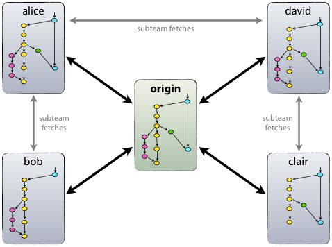
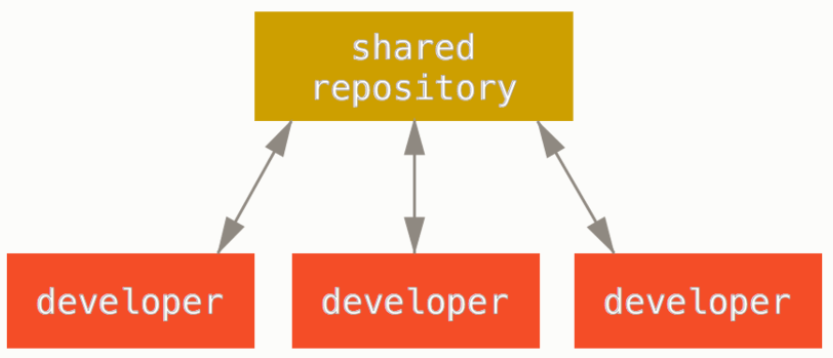
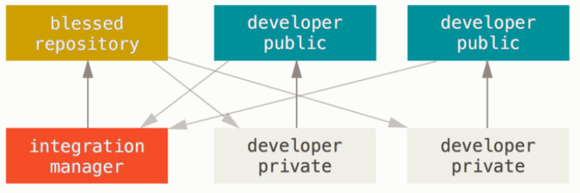
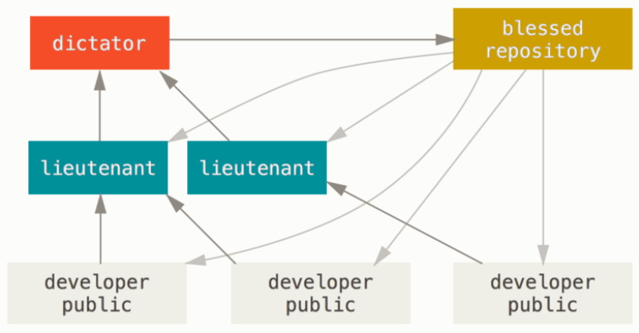

# Git Expert - Distributed Workflows

\[\[_TOC_\]\]

| Is this section core or elective? | Expected time to completion |
| --- | ---- |
| elective | before last meeting |

## Goal

This section deals with _Git workflows_, which are recipes for
working together with Git in a consistent manner. We will focus on the most
widely used workflows. After this chapter you should know how to contribute
code in most projects.

## Introduction

Git is a distributed version control system (DVCS). Hence Git allows that each
developer or team has their own repository - not just locally on their
computer but also stored on a server somewhere. It is not necessary
that a central Git repository exists, i.e., a repository with which every
developer directly interacts. However, on most projects there typically is
one, and on most d-fine projects you will therefore use a
[centralized workflow](#centralized-workflow).

Some facts to keep in mind about distributed workflows and repositories:

- Different repositories can all be in a different state.
- Arbitrarily complex workflows are possible, with the workflow usually
  chosen based on the size and organizational structure of a project.
- A **private** repository can only be cloned and viewed by its owner and any
  collaborator the owner chooses. Local repositories are nearly
  always private.
- A **public** repository is visible to everyone who has access to the "location"
  of the repository. Meaning, if the repository is created on
  [GitHub](https://docs.github.com/) everyone on the internet can access the
  repository. Especially, everyone is able to create a fork as starting point of
  its own new project. Public repositories are usually stored on a server.

Now we will introduce the most common workflows in ascending
order of complexity.

## Centralized Workflow

In a centralized workflow a single central repository exists. All developers
work on their clone of this repository locally and commit and push their changes
directly into the central repository.

source:
<https://git-scm.com/book/en/v2/Distributed-Git-Distributed-Workflows>

Without further means, this workflow does not enforce a four-eyes principle or
a code review. However, Git servers such as GitLab or Bitbucket are often
configured so developers cannot push their changes to any branch, but only to
feature branches, effectively protecting the main development and release branches.

## Integration-Manager Workflow

Every developer has two repositories: A public one and a private one.
Additionally, there is a special repository, often designated 'blessed', with
the official project code. Furthermore, there is one special developer designated
as the 'integration manager'. The workflow is as follows:

1. Developers clone the state of the blessed repository.
1. Then they work in their private repository and eventually push their changes
   to their public repository.
1. A developer sends the integration manager an email asking her to pull the
   changes.
1. The integration manager pulls from the developer's public repository and
   reviews and merges the changes locally.
1. The integration manager pushes the merged result to the blessed repository.

source:
<https://git-scm.com/book/en/v2/Distributed-Git-Distributed-Workflows>

The integration manager workflow enforces a four-eyes principle. Another
advantage for larger development teams over the centralized workflow is that the
main repository does not become cluttered with feature branches.

## Dictator and Lieutenants Workflow

In this workflow, developers again work within their own repository.
Afterwards, they inform the "lieutenant" that their changes are ready for a
review. The lieutenant locally merges the changes from the remote repository
into the current state of the blessed repository. After a review and functional
tests, the lieutenant pushes the local changes into her public repository and
informs the "dictator". The dictator locally merges the changes of the lieutenant's
remote branch in the current state of the blessed repository, checks
everything again and finally pushes that state into the blessed repository.

source:
<https://git-scm.com/book/en/v2/Distributed-Git-Distributed-Workflows>

This workflow scales to any number of developers and safeguards the main
repository very well due to at least two code reviews. It is used for the
development of the Linux kernel.

## Commands in Git

- `git remote`\
  Manages remote repositories.

- `git fetch (<repo>) (<remote branch>)`\
  Fetches all changes from remote repo (and named branch).

- `git pull (<repo>) (<remote branch>)`\
  Fetches all changes from remote repo (and named branch) and merges them into the
  current branch.

- `git push (<repo>) (<local branch>:<remote branch>)`\
  Pushes the changes from local branch onto remote branch.

- `git push -f (<repo>) (<local branch>:<remote branch>)`\
  The -f is the short form of "--force" and it overwrites the remote repository
  branch by your local one. This means that any upstream changes (changes in the
  corresponding remote branch) that may have been done since your last pull are
  deleted. It should only be used after a commit --amend. For a more detailed
  explanation, see [here][1].

### Changing history

The following commands should only be executed with caution.

- `git commit --amend`\
  Amends the last commit instead of creating a new commit. You should only use it,
  when you have to fix the last commit and none of your teammates have pulled this
  commit before you can push the fix with "--force" option. More details on this
  can also be found [here][1].

- `git rebase (-i)`\
  Allows modifying, skipping, or squashing all commit since the named one. One
  basic command is 'git rebase \<upstream> \<currentBranch>'. Here, all applied
  commits from your currentBranch are locally applied again on the current head of
  the upstream branch. You are locally still on the \<currentBranch> but the
  history has changed. More details on this can also be found [here][2].

## Exercise

Remember [how to submit solutions.](../Introduction#review-process-for-the-first-chapters-on-git)

_Imagine we have a developer Alice, who works on a software product,
and also has created her own local copy of a shared remote repository._

### Setup

- Setup a local repository in a folder named `remote` as a bare repository (use
  the `--bare` option with `git init`).
- Clone that repository into a folder named `repoAlice`.
- Create some changes in _repoAlice_ and push them to the remote repository.

_Alice starts developing two new features at the same time. In order to do so, she creates
a feature branch for each of the two new features and pushes her changes accordingly._

### Push, Pull and Change History

Exercise 1 (in _repoAlice_)

- Create a _featureOne_ branch from your current _master_ branch.
- Create a second _featureTwo_ branch from your current _featureOne_ branch.
- Checkout the _featureOne_ branch. Add some changes, commit, and push them.
- Checkout the _featureTwo_ branch. Add some other changes, commit, and push them.
- Compare the history of your _featureOne_ and _featureTwo_ branches.

_After Alice pushed changes into both feature branches she notices that feature two
depends on feature one and should have rather been build on top of the changes of feature
one instead of both features starting on the same code base._

- Rebase your entire _featureTwo_ branch onto the _featureOne_ branch.
- Compare the history of the two branches. What has happened?

_Imagine now a second developer Bob joins Alice working on the same software product.
Since the changes which have to be made for feature one are very complex they both work
on feature one simultaneously. Since Alice has already pushed some first changes into the
featureOne branch in the remote repository, Bob has to pull her changes into his local
copy first._

Exercise 2 (in _repoAlice_ and _repoBob_)

- Create a second clone of the remote repository in a folder called `repoBob`
- In _repoAlice_: Push all changes of the _featureOne_ branch to remote.
- In _repoBob_: Pull all changes of _featureOne_, such that both Alice's and Bob's
  local repositories are now identical regarding the branch _featureOne_.
- If you have not done so already, switch to the branch _featureOne_ on both _repoAlice_
  and _repoBob_.

_Alice notices that she accidentally pushed incorrect changes to the remote repository,
therefore she amends her last commit in the remote repository. Afterwards, Bob can
pull the amended commit into his local repository._

- In _repoAlice_: Amend your last commit by making some changes and
  _commit --amend_ them.
- In _repoAlice_: Push your changes to the remote repository. (Hint: you have to
  use _--force_)
- In _repoBob_: Pull the changes in the _featureOne_ branch.
- Compare the histories of _featureOne_ in _repoAlice_ and _repoBob_. What effect did the
  force-push have? Was _commit --amend_ a good idea?
- What command do you need to execute to get content and history of the _featureOne_
  branch in _repoBob_ in line with the _featureOne_ branch in _repoAlice_ and _remote_?

## Further reading

- [Git-SCM - Distributed-Git-Distributed-Workflows](https://git-scm.com/book/en/v2/Distributed-Git-Distributed-Workflows)
- [Git-SCM - Git Rebase][2]
- [Bitbucket Git - Comparing Workflows](https://www.atlassian.com/git/tutorials/comparing-workflows)
- [Bitbucket Git - Syncing](https://www.atlassian.com/git/tutorials/syncing)
- [Atlassian Git Tutorial - Git Push][1]

## Navigation

- [Back to "Git Advanced"](./git_advanced/GitAdvanced)
- [Return to top level](../index)

[1]: https://www.atlassian.com/git/tutorials/syncing/git-push
[2]: https://git-scm.com/docs/git-rebase
