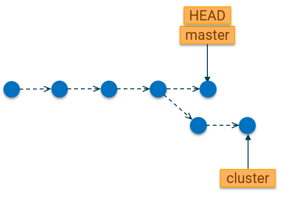
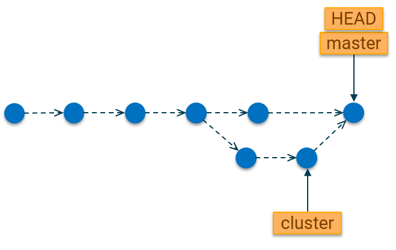

# Merging

{:toc}

| Is this section core or elective? | Expected time to completion |
| --- | ---- |
| core | before third meeting |

## Learning goals

In the previous section, you learned the basics of git branches. This section
will show you how to merge branches together

## What is a merge?

A merge is a means of bringing a separated (branched) commit history
back together. The commits on separate branches can be put together to create a
unified line with all changes included by means of a git merge.

## Simple merging

Let us start with our repository state from the [previous section](./Branches)
on branching, with the `master` branch currently checked-out.

Now assuming our `cluster` experiment was successful and we would like to merge
the changes from `cluster` branch into the `master` branch, we would use the
following command:

`git merge cluster`

Assuming there are no merge conflicts, our repository will now look like this:

Things to note:

- Git preserves the history we had on the `cluster` branch. Each of the commits
  are still visible in our main history.
- A new commit was created on the `master` branch to denote the point at which
  changes from the `cluster` branch were merged. This commit is necessary
  because there were also changes on the `master` branch after `cluster` was
  created. Git has to resolve these changes, which were made in parallel and
  uses a new commit (called the "merge commit" to do so). In cases where the
  master branch is a direct ancestor of the `cluster` branch, a merge commit is
  not necessary and git will just realign the commits into the main line.
- The `cluster` branch still exists after the merge. We can delete it after
  merging by using the command we learned in the previous section:
  `git branch --delete cluster`

## Resolving merge conflicts

A basic commit as shown above works in cases where there were no conflicting
changes between the 2 branches. A conflicting change refers to a case where the
same file(s) are modified at the same places on both branches.

In such a scenario, it is necessary to resolve the differences and create a new
unified version of the file(s) as part of the merge.

The conflicts in the files are usually marked with the following characters:
`<<<<<<<<`, `==========`, `>>>>>>>>` The part before `==========` is typically
the content on the current branch, and the part afterwards is the content of the
incoming branch.

By default, git attempts to intelligently resolve conflicts when the changes to
the same files have been made in a way that do not override each other. However,
in some cases, it is not possible to know which changes should be merged because
the changes are incompatible.

For these scenarios, git has the command `git mergetool`. This will start any
editor utilities on your computer, which can be used to resolve merge conflicts.
You can specify a preferred tool command by using the `--tool` option, e.g.

`git mergetool --tool=<difftool>`

The tool will be started and you will be able to edit the merged file to contain
only the changes you desire. Once that is complete, you can save the file. In
case there are several files with conflicts, git will prompt you in turn for
each one.

Once the conflict resolution is complete, you will have to commit those changes
to complete the merge using the `git commit -m 'Commit message'` command.

Note: In the basic merge, git automatically creates the merge commit for you
because there are no conflicts. But in cases of conflict, you need to do this
yourself.

## Aborting a merge

After running the git merge command, you might decide not to continue with the
merge. In this scenario, it is desirable to return your current branch to the
state it was before the merge started. This can be achieved with the following
command:

`git merge --abort`

Want to test your newly acquired knowledge? Then why not proceed to the
[next section](./Exercises) for some exercises?

## Further reading

- [Basic Git Branching and Merging](https://git-scm.com/book/en/v2/Git-Branching-Basic-Branching-and-Merging)
- [Git merge command reference](https://git-scm.com/docs/git-merge)
- [Git mergetool command reference](https://www.git-scm.com/docs/git-mergetool)
- [Atlassian Git Merge Guide](https://www.atlassian.com/git/tutorials/using-branches/git-merge)
